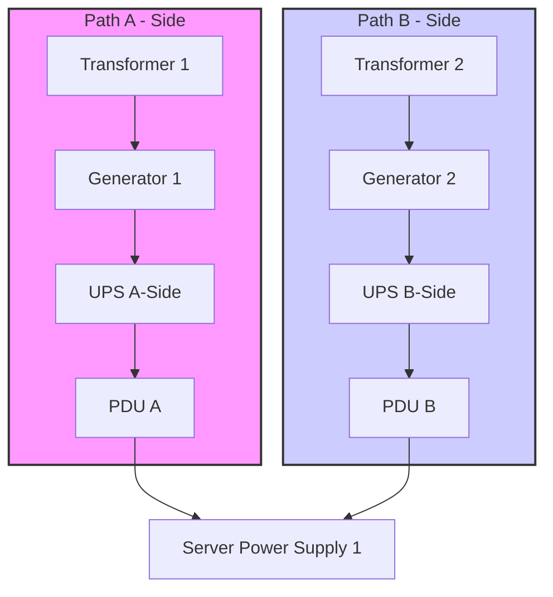

# Level 3: Energy Orchestration (EN 50600-2-2)

  

## 📌 Giriş
EN 50600-2-2, bir veri merkezinin can damarı olan enerji altyapısını tanımlar. Hedef, belirlenen **Availability Class** (Class 1-4) gereksinimlerini karşılayan bir güç dağıtım sistemi kurmaktır.

## ⚡ Güç Kaynağı Hiyerarşisi
1. **Primer Kaynak:** Şebeke elektriği (Trafo merkezi).
2. **Yedek Kaynak:** Jeneratör setleri (Prime power rating).
3. **Kesintisiz Geçiş:** UPS (Uninterruptible Power Supply) sistemleri.
4. **Acil Durum Stop (EPO):** Yangın veya büyük arıza anında gücü kesen sistemler.

## 🔌 Dağıtım Topolojileri
Kullanılabilirlik sınıfına göre topolojiler şu şekildedir:

### Class 3 (2N) Reference Architecture

- **Class 1 (Single Path):** Yedeklilik yok. Bir bileşen arızası sistemin durmasına neden olur.
- **Class 2 (N+1):** Yedekli bileşenler var (Örn: 3 jeneratör varken 4 jeneratör olması), ancak hala tek dağıtım hattı mevcuttur.
- **Class 3 (2N):** Bağımsız iki enerji hattı (A-Side, B-Side). Eşzamanlı bakım yapılabilir. Hatlardan biri kapatılsa da sistem çalışmaya devam eder.
- **Class 4 (2(N+1)):** Hem hatlar hem bileşenler yedeklidir. Bir hata anında (Fault) sistem kesintisiz devam eder.

## 🔋 Batarya ve UPS Yönetimi
- **VRLA / Li-Ion:** Batarya teknolojisi seçimi.
- **Otonomi Süresi:** Kritik yüklerin jeneratör devreye girene kadar (veya kontrollü kapatma yapılana kadar) beslenmesi gereken süre.
- **STS (Static Transfer Switch):** İki farklı güç kaynağı arasında milisaniyeler içinde geçiş yapan cihazlar.

## 📊 İzleme ve Kontrol
- **PMS (Power Management System):** Enerji kalitesini (Harmonik, voltaj dalgalanması) ve tüketimini gerçek zamanlı izlemek esastır.

---
[⬅️ Geri Dön](../../README.md)
