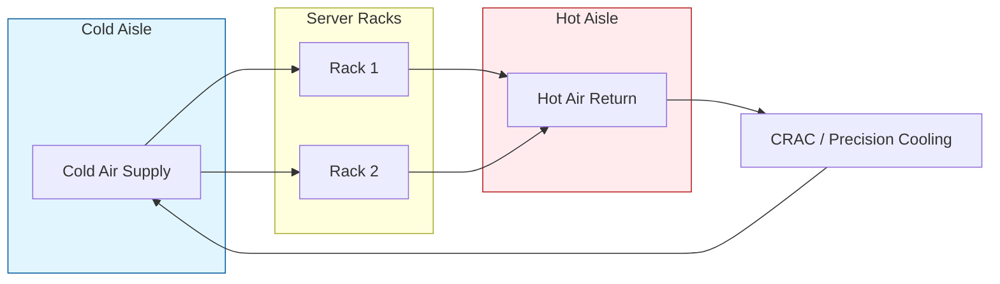

# Level 4: Environmental Precision (EN 50600-2-3)

  

## 📌 Giriş
EN 50600-2-3, veri merkezinin iç iklimlendirme ve çevresel kontrol sistemlerini kapsar. Hedef, sunucu ekipmanlarının belirlenen sıcaklık ve nem sınırları (ASHRAE standartlarına uygun) içinde çalışmasını sağlamaktır.

## ❄️ Soğutma Stratejileri ve Topolojileri
EN 50600-2-3'te tanımlanan soğutma yaklaşımları:
- **Hava Soğutma (Air Cooling):** Geleneksel CRAC/CRAH üniteleriyle soğuk hava üflenmesi.
- **Sıvı Soğutma (Liquid Cooling):** Çeşitli teknolojilerle (Direct-to-chip, Immersion) ısının su veya özel sıvılarla taşınması.

## 🏛️ Hava Akımı Yönetimi (Airflow Management)

### Hot/Cold Aisle Containment Model

- **Sıcak/Soğuk Koridor (Hot/Cold Aisle):** Hava karışımının önlenmesi için temel yapı.
- **Kapatma (Containment):** Soğuk koridor kapatma veya sıcak koridor kapatma ile enerji verimliliğinin (%25-30'a kadar) artırılması.

## 🌡️ Çevresel Parametreler
- **Sıcaklık Sınırları:** Genellikle 18°C - 27°C arası (ASHRAE Class A1).
- **Nem Kontrolü:** Statik elektriği veya korozyonu önlemek için optimize edilmiş çiğ noktası (Dew Point) takibi.
- **Hava Kalitesi:** Toz ve kontaminant filtreleme (ISO 14644-1 Class 8 ve üzeri).

## 📊 Ölçüm ve Metrikler
- **Delta T (ΔT):** Kabine giren ve çıkan hava arasındaki sıcaklık farkı.
- **PUE (Power Usage Effectiveness):** Soğutma sisteminin toplam enerji tüketimine etkisi.

---
[⬅️ Geri Dön](../../README.md)
